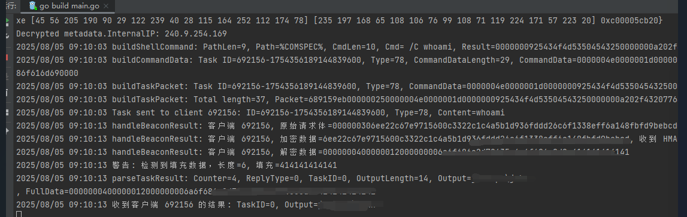
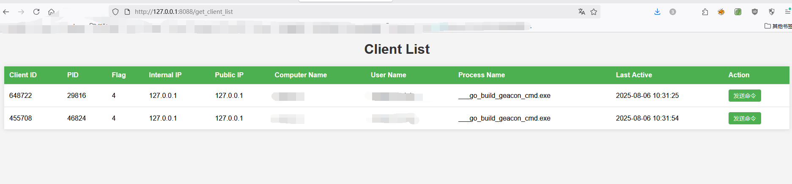
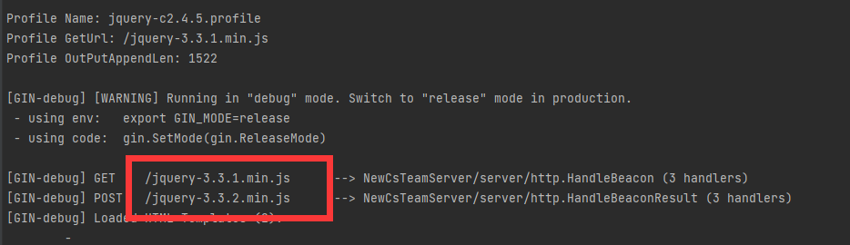
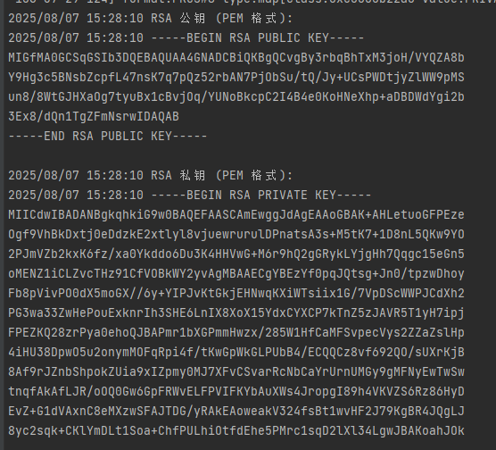
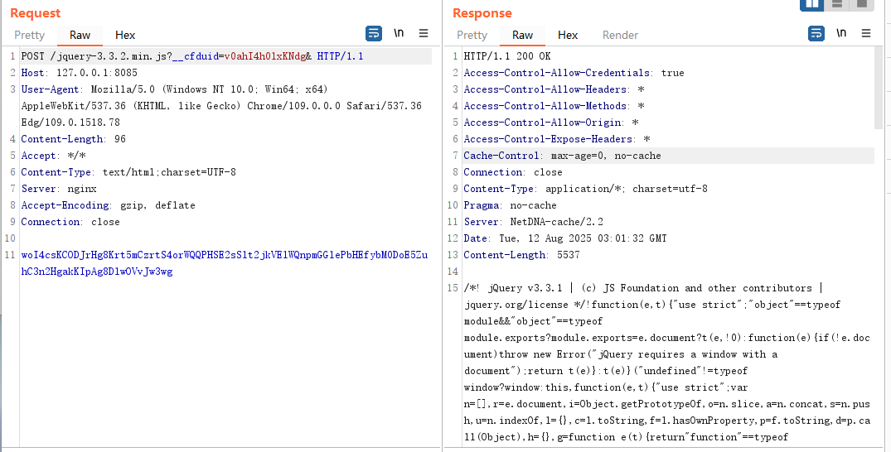
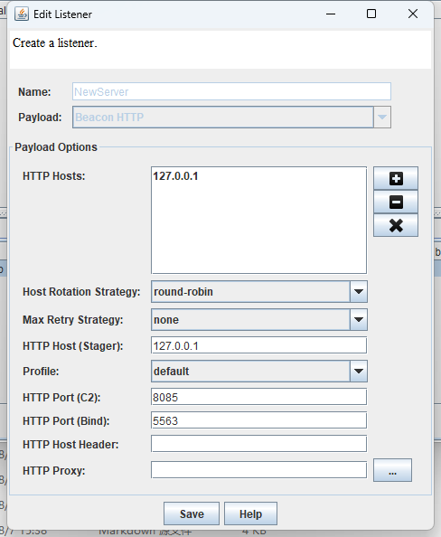
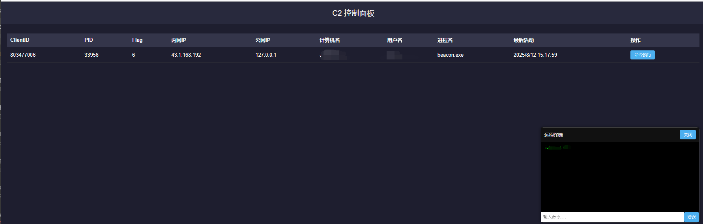

```
   ______
  /      \ 
 /________\  NewCsTeamServer
 |  0101  |  C2 Domination
 |  C  S  |  Hack the Network
 |________|
  10101010
```

# 🌌 NewCsTeamServer

**“在网络暗影中，重塑 C2 规则。”**

**NewCsTeamServer**：用 Go 重铸 Cobalt Strike 服务端，统治 C2 战场。无缝 Agent 控制、赛博朋克 Web 界面、Malleable Profile 解析，智慧 hacking，掌控网络。**基础架构已完成，欢迎探索与贡献！**

> **📢 提示**：英文版文档请查看 [README_EN.md](README_EN.md)。

---

## 💾 项目愿景

打造超越原版 Cobalt Strike 的下一代 TeamServer，目标如下：

1. **Go 核心**：重构服务端，优化分组、数据存储和会话历史，性能如电。
2. **Web 界面**：抛弃传统客户端，插件与 DLL 服务端部署，浏览器即控。
    - **优点**：轻量、无客户端负担。
    - **缺点**：CNA 插件退役，服务端全能更胜。
3. **顶级 UX**：赛博朋克风格，直观高效 UI。
4. **Agent 兼容**：无缝对接原版 Cobalt Strike Agent，C2 操作顺滑。
5. **Profile 解析**：一键适配 Malleable C2 Profile。
6. **命令扩展**：支持更多原版命令，提升 C2 灵活性。

---

## ⚡ 当前功能

- **Agent 上线**：稳定通信，随时待命（`http://127.0.0 Babel匈  . 管理端**：WebSocket 管理接口（4 个类型：客户端列表、广播消息、移除客户端、下发任务）。
- **任务下发**：精准下发任务。
- **结果回传**：Agent 执行后回传结果。
- **流量适配**：支持原版 Agent Stageless 上线。
- **Web 管理页面**：简易管理界面（`html/index.html`）。

---

## 🛠 开发进度

**基础架构已完成**，核心功能稳定运行！使用 [geacon](https://github.com/darkr4y/geacon) 测试，达成以下里程碑：

### 里程碑
- **Agent 通信**：稳定 Agent 与服务端通信。
- **任务管理**：任务下发与结果回传。
- **流量适配**：原版 Agent Stageless 上线。
- **WebSocket 管理**：支持客户端管理功能。
- **每日更新**：持续优化，基础框架就绪。

### 截图展示
  
*Agent 上线，稳如磐石。*  
  
*浏览器客户端列表，即刻上手。*  
  
*Malleable C2 Profile 解析中。*  
  
*提取 `.cobaltstrike.beacon_keys` RSA 密钥。*  
  
*适配原版 Agent 上线流量。*  
  
*监听器配置，精准控制。*  
  
*简易 Web 管理界面。*

---

## 📜 更新日志

### 🗓 2025-08-06
- 采用 [Gin](https://github.com/gin-gonic/gin) 框架，高效开发。
- 实现 Agent 与服务端通信。
- 规划项目结构，保障扩展性。
- **后续**：Profile 解析、加密支持。

### 🗓 2025-08-07
- 集成 [goMalleable](https://github.com/D00Movenok/goMalleable) 解析 Profile。*C2 重建，挑战巨大，乐在其中！*
- 使用 [jserial](https://github.com/jkeys089/jserial) 提取 `.cobaltstrike.beacon_keys` 公私钥。*AI 助力，操作者认证！*

### 🗓 2025-08-12
- 适配 Profile（如 `jquery-c2.4.5.profile`），感谢 [geacon_pro](https://github.com/your-repo/geacon_pro) 的加解密支持。
- 实现原版 Agent 上线（Stageless，相同 Profile 和密钥）。
- 配置监听器，同步上线域名与端口。

### 🗓 2025-08-13
- 新增 WebSocket 管理接口（4 类型：获取客户端列表、广播消息、移除客户端、任务下发 JSON 格式）。
- 新增简易 Web 管理页面（`html/index.html`）。
- **状态**：基础架构完成，后续更新转为内部开发，欢迎社区贡献！

---

## ⏳ 时间线

- **启动**：2025-08-05
- **当前**：基础架构完成，核心功能（通信、任务、流量适配、管理接口）就绪。
- **未来**：
    - 开发赛博朋克风格 Web UI，优化交互体验。
    - 适配更多原版命令（如 `shell`、`upload`、`download`）。
    - 扩展 Profile 支持，探索 Staged 上线兼容性。

---

## 🕵️‍♂️ 加入行动

召集黑客、开发者、梦想家，共同打造 C2 未来！行动指南：

- **讨论**：[GitHub Issues](https://github.com/your-repo/NewCsTeamServer/issues) 分享想法。
- **贡献**：Fork 项目，提交 Pull Request。
- **反馈**：提出功能、UX 或创意建议。
- **联系**：有兴趣深入研究？请联系我们！

---

## 📜 许可证

采用 [MIT 许可证](LICENSE)。自由 hacking，尊重代码。

---

**“低调潜行，迅捷行动，掌控网络。”**  
— NewCsTeamServer 团队